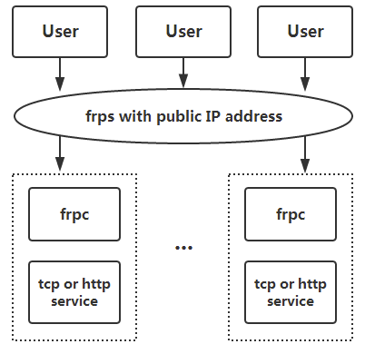
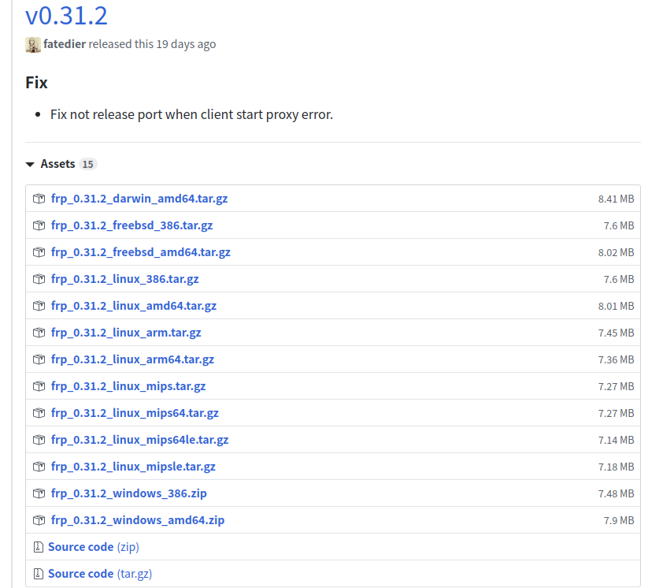
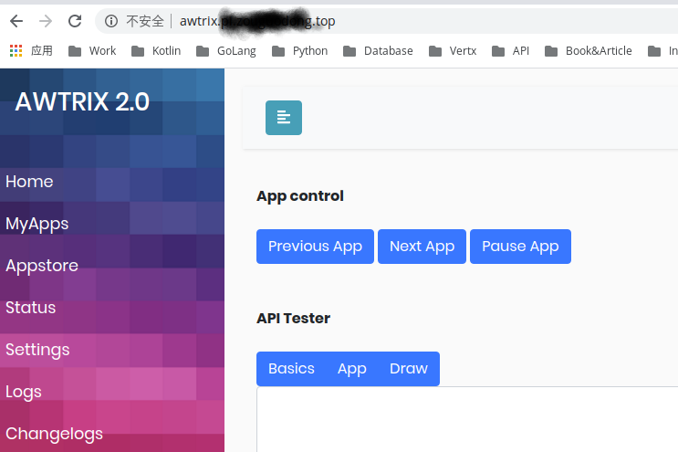

# 开篇废话

第一次接触到内网穿透这一概念大概是20017年左右，手中有一树莓派，想到如何能够在公司访问运行在家里的树莓派呢？百度之，基本就是下面这种情况——广告劝退，我一个小小的需求，要什么花里胡哨的东西，当时不了了之。后来了解到NATAPP，使用方便，价格也不贵，关键是配置简单，还支持自定义二级域名（当然是要钱的啦），这样使用了很长一段时间。但后来发现自己的使用场景是希望长期处于内网穿透，偶尔用一下，频率相当低。即使使用NATAPP这样低至9元/月的服务都嫌贵。

<!-- more -->


无疑，开源软件是拯救我的唯一方式。gayhub是个好地方。[goproxy（8k star）](https://github.com/snail007/goproxy)和[frp（33k star）](https://github.com/fatedier/frp)映入眼帘。大致查看了使用教程，无论从简易程度，还是受欢迎程度，我都倾向于选择frp。它通过命令行配置。别跟我整那些花里胡哨的dashboard，简单易用才是硬道理，我不需要复杂的功能。

# frp简介

frp使用go语言编写，工作原理是反向代理，下面的官方的架构图。



需要说明的是，该项目目前处于开发状态，未经充分测试和验证，因此不推荐用于生产环境。

关于使用frp的前置条件，是你需要有一台VPS，我手里有一台阿里云服务器，正好。

# 需求说明

自己目前有两个需求

- 可通过公网IP ssh到树莓派进行操作
- 可通过域名访问运行在树莓派上的web服务，端口7000。暂时只要http

下面针对这两个需求进行配置

# 服务端

## frp配置

到项目的[release页](https://github.com/fatedier/frp/releases)下载符合自己服务器版本的压缩包。



我的VPS是ubuntu 64位，因此下载[frp_0.31.2_linux_amd64.tar.gz](https://github.com/fatedier/frp/releases/download/v0.31.2/frp_0.31.2_linux_amd64.tar.gz)。 依照如下步骤

- 解压

  ```bash
  tar -zxvf frp_0.31.2_linux_amd64.tar.gz
  ```

- 修改ini配置文件

  修改目录下的服务器配置文件frps.ini，注意别改到客户端配置文件frpc.ini。

  这里指定了frp的tcp服务监听7000端口，http服务监听7001端口。

  ```ini
  # frps.ini
  [common]
  bind_port = 7000
  vhost_http_port = 7001
  ```

- 启动

  ```bash
  ./frps -c ./frps.ini
  ```

  看到如下输出，代表成功了。

  ```bash
  2020/02/23 19:09:37 [I] [service.go:152] frps tcp listen on 0.0.0.0:7000                    
  2020/02/23 19:09:37 [I] [service.go:194] http service listen on 0.0.0.0:7001               
  2020/02/23 19:09:37 [I] [root.go:205] start frps success 
  ```

## nginx配置

第二点需求可以通过nginx实现，直接在80端口上监听，将对应域名转发到该域名下7001端口。

```nginx
server {
    listen 80;
    server_name awtrix.pi.zouguodong.top;
    
    location / {
        proxy_pass http://awtrix.pi.zouguodong.top:7001/;
    }
}
```

# 客户端

frp将客户端和服务端文件放在一个包中，你可以观察到上面解压出来的包中包含了frpc——即客户端命令和配置文件。因此，如果客户端环境也是linux 64位，可以直接使用刚才下载的那个包。

但我的客户端是树莓派，因此需要下载**arm 32位版**，即[frp_0.31.2_linux_arm.tar.gz](https://github.com/fatedier/frp/releases/download/v0.31.2/frp_0.31.2_linux_arm.tar.gz)，注意不要下载64位，树莓派3使用了64位CPU，但操作系统依然是32位。

执行如下步骤

- 解压

  ```bash
  tar -zxvf frp_0.31.2_linux_arm.tar.gz
  ```

- 修改配置文件

  修改frpc.ini

  ```ini
  # frpc.ini
  # 这里填写服务端的IP和端口号
  [common]
  server_addr = x.x.x.x
  server_port = 7000
  
  # 将服务端的6000端口转发到本地的22端口
  [ssh]
  type = tcp
  local_ip = 127.0.0.1
  local_port = 22
  remote_port = 6000
  
  # 将服务端的指定域名的请求转发到本地7000端口
  [web]
  type = http
  local_port = 7000
  custom_domains = <你的域名>
  ```

- 启动

  ```bash
  ./frpc -c ./frpc.ini
  ```

  启动输出如下

  ```bash
  2020/02/23 19:19:34 [I] [service.go:250] [ae46f3632a860bba] login to server success, get run id [ae46f3632a860bba], server udp port [0]
  2020/02/23 19:19:34 [I] [proxy_manager.go:144] [ae46f3632a860bba] proxy added: [web ssh]
  2020/02/23 19:19:34 [I] [control.go:164] [ae46f3632a860bba] [web] start proxy success
  2020/02/23 19:19:34 [I] [control.go:164] [ae46f3632a860bba] [ssh] start proxy success
  ```

  同时观察服务端输出，增加了如下输出

  ```bash
  2020/02/23 19:19:34 [I] [service.go:392] [ae46f3632a860bba] client login info: ip [113.110.200.14:46946] version [0.31.2] hostname [] os [linux] arch [arm]                                                                                                                                            
  2020/02/23 19:19:34 [I] [http.go:92] [ae46f3632a860bba] [web] http proxy listen for host [xxx.xxx.xxx] location [] group []
  2020/02/23 19:19:34 [I] [control.go:445] [ae46f3632a860bba] new proxy [web] success
  2020/02/23 19:19:34 [I] [tcp.go:63] [ae46f3632a860bba] [ssh] tcp proxy listen port [6000]
  2020/02/23 19:19:34 [I] [control.go:445] [ae46f3632a860bba] new proxy [ssh] success
  ```

  至此，通过ssh命令登录VPS的6000端口，即可远程访问到树莓派；通过指定的域名，即可访问到树莓派中暴露于7000端口的web服务。

# 验证

- 测试需求一

  ```bash
  # 尝试远程ssh登录
  ssh -oPort=6000 pi@<VPS公网IP>
  ```

  ssh登录成功

  ```bash
  floyd@floyd-ThinkPad-T490:~$ ssh -oPort=6000 pi@xxx.xxx.xxx.xxx
  The authenticity of host '[blog]:6000 ([xxx.xxx.xxx.xxx]:6000)' can't be established.
  ECDSA key fingerprint is SHA256:o4+aSfAmCMmE5l/UAj+8/XJ8YyWDYrMzlbVelu0ggAA.
  Are you sure you want to continue connecting (yes/no)? 
  ```

- 测试需求二

  浏览器访问指定域名，成功访问到树莓派中运行的服务——AWTRIX控制台

  

# 总结

通过frp，完美实现了上述两个需求，关键是免费。当然，该软件还有更加强大的功能，如有需要，尽管去折腾。

在配置过程中也有遇到坑和觉得可以改善的地方，如下

- VPS安全组问题。阿里云的访问白名单默认没有开启6000\7000\7001三个端口的访问，需要手动添加，否则无法访问

  

- 服务端可客户端的启动脚本，可以加入开机自启动。为了方便，服务端使用了supervisor进行管理。客户端则直接添加到/etc/rc.local

  - 服务端

    supervisor配置文件

    ```bash
    [program:frp]
    directory = /root/frp/frp_0.31.2_linux_amd64
    command = /root/frp/frp_0.31.2_linux_amd64/frps -c /root/frp/frp_0.31.2_linux_amd64/frps.ini
    autostart = true
    startsecs = 10
    autorestart = true
    startretries = 3
    user = root
    redirect_stderr = true
    stdout_logfile_maxbytes = 50MB
    stdout_logfile_backups = 20
    stdout_logfile = /var/log/frp/frp.log
    ```

    ```bash
    # 更新supervisor
    supervisorctl update
    ```

  - 客户端

    在/etc/systemd/system下创建frp.service文件，内容如下

    ```ini
    [Unit]
    Description=FRP Client
    After=network.target
    
    [Service]
    Type=simple
    WorkingDirectory=/home/pi/frp/frp_0.31.2_linux_arm
    ExecStart=/home/pi/frp/frp_0.31.2_linux_arm/frpc -c /home/pi/frp/frp_0.31.2_linux_arm/frpc.ini
    
    [Install]
    WantedBy=multi-user.target
    ```

    执行命令如下

    ```bash
    # 自启动开启
    sudo systemctl enable frp.service
    # 启动服务
    sudo systemctl start frp.service
    ```

# 参考文档

1. [frp手册](https://github.com/fatedier/frp/blob/master/README.md)

