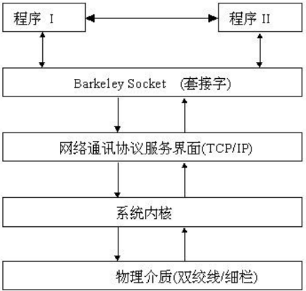
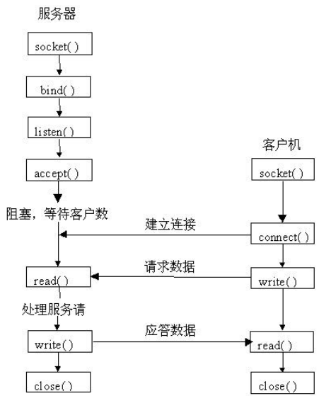
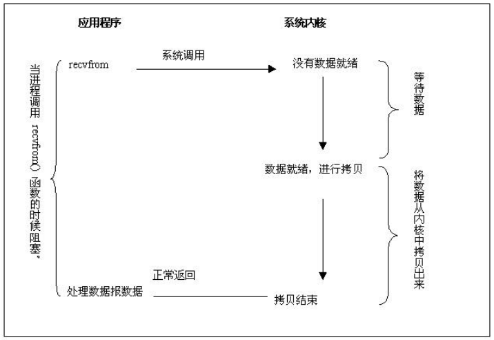
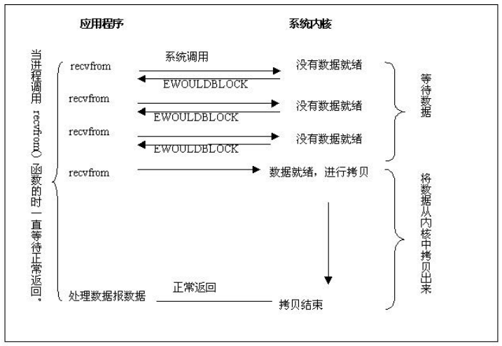
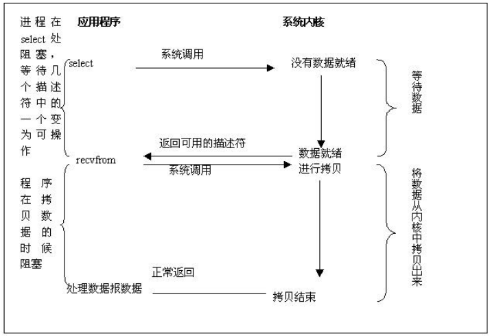
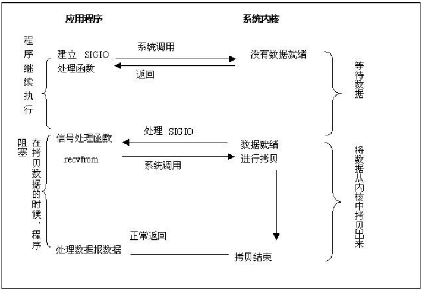
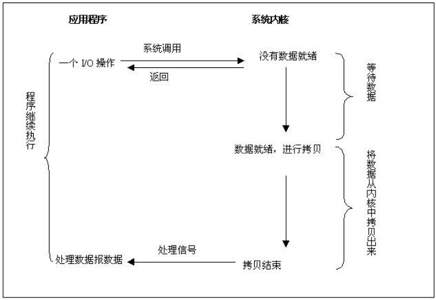

BIO、NIO、NIO2、AIO、Reactor、Proactor、EventLoop、Linux五种IO模型

上述术语和概念，相信大多数人都知道或部分知道，但都无法完整表达他们之间的意思，处于模棱两可的状态。我也不例外，而触发写这篇文章的契机，是有人问起我Vertx高性能的原因是什么时？我不假思索地回答NIO，因为在我的印象中，Vertx基于Netty实现，Netty又是对NIO的包装。但仔细想想，用NIO就能高性能吗？NIO和Vertx的EventLoop有什么关系呢？和Reactor又是什么关系呢？——我不禁开始思考人生。

下面就开始探索吧

<!-- more -->

# 疑问

带着疑问探索是最有效手段。本文专注于搞懂如下几个问题

1. Java中的各种IO概念是怎么回事？
2. Linux五种IO模型，以及他们和Java IO的关系？
3. Netty和NIO？
4. Java IO和Reactor设计模式的关系？

# Java的IO

截止目前，Java的IO有三种：BIO、NIO、NIO2(AIO)，他们被引入的时间点如下。

- JDK 1.0 - JDK1.3 Java都只有BIO，很多Unix的概念或接口在其库中都没有体现。
- 2002年发布JDK 1.4，增加java.nio包，主要引入了支持异步操作的各种核心类库：管道、缓冲区、Channel、Selector等。
- 2011年发布JDK 1.7，对原来的NIO包进行了升级，称为NIO2.0，主要提供了AIO功能。

## BIO

即传统的Socket API，很多Java程序员的第一个网络程序就是BIO。BIO的问题是数据的读取会阻塞线程，提升性能的方式是引入多线程，而系统能够启动线程的数量有限，不可避免会引入线程池，而线程池又会造成并发处理请求不够多，从而限制吞吐量。且线程切换费时费力，浪费CPU资源。因此在处理高并发网络请求时BIO是不堪重任的。

```kotlin
const val PORT = 9090

fun main() {

  val serverSocket = ServerSocket(PORT)

  while (true) {
    val socket = serverSocket.accept()
    val inputStream = socket.getInputStream()
    val outputStream = socket.getOutputStream()

    val reader = BufferedReader(InputStreamReader(inputStream))
    val writer = PrintWriter(OutputStreamWriter(outputStream))

    val line = reader.readLine()
    writer.println(line)
    writer.flush()

    writer.close()
    socket.close()
  }

}
```

## NIO

Java NIO引入了多路选择器Selector、通道Channel、缓存区ByteBuffer的概念。通过轮询选择器的方式获取准备好的Channel，数据读取均采用ByteBuffer。

在使用上我们只需要在多路选择器上注册感兴趣的Channel，然后不断轮训该选择器，每当通道就绪时，我们再处理对应的事件，可响应的事件如下

- ACCEPT

  服务端事件，表示有客户端连接

- CONNCET

  客户端时间，表示已经连接到服务端

- READ

  系统已将数据读取到缓冲区，触发该事件，我们从缓冲区读取数据即可。

- WRITE

  系统检查缓冲区是否可写，如果可写，触发该事件，我们向缓冲区写入即可。

典型的示例如下。与BIO相比，NIO为我们节省了阻塞等待读取数据的时间，数据不再是我们阻塞等待，而是交给系统读取到执行位置(缓冲区)，我们再直接从缓冲区读取。

NIO的缺点是使用过于复杂，且存在空轮训的bug。

注意NIO != 高性能，当连接数小于1000、并发程度不高时，NIO并没有显著的性能优势。

```kotlin
/**
 * 这里使用了两个Selector，其实也完全可以仅仅使用一个Selector进行轮训
 * JDK 的 NIO 底层由 epoll 实现，该实现饱受诟病的空轮询 bug 会导致 cpu 飙升 100%
 */
fun main() {
  // 用于轮询是否有新的连接，当产生新的连接时，将新连接绑定在client selector上进行数据轮训
  val serverSelector = Selector.open()
  // 轮训连接是否有数据可读
  val clientSelector = Selector.open()

  // 处理连接
  Thread {
    val serverChannel = ServerSocketChannel.open()
    serverChannel.socket().bind(InetSocketAddress(9090))
    serverChannel.configureBlocking(false)
    serverChannel.register(serverSelector, SelectionKey.OP_ACCEPT)

    while (true) {
      if (serverSelector.select(1) > 0) {
        val it = serverSelector.selectedKeys().iterator()
        while (it.hasNext()) {
          val key = it.next()
          if (key.isAcceptable) {
            val clientChannel = (key.channel() as ServerSocketChannel).accept()
            clientChannel.configureBlocking(false)
            clientChannel.register(clientSelector, SelectionKey.OP_READ)
          }
          it.remove()
        }
      }
    }
  }.start()

  // 处理数据
  Thread {
    while (true) {
      if (clientSelector.select(1) > 0) {
        val it = clientSelector.selectedKeys().iterator()
        while (it.hasNext()) {
          val key = it.next()
          if (key.isReadable) {
            val clientChannel = key.channel() as SocketChannel
            val byteBuffer = ByteBuffer.allocate(1024)
            clientChannel.read(byteBuffer)
            byteBuffer.flip()
            clientChannel.write(byteBuffer)
            byteBuffer.clear()
            clientChannel.close()
          }
          it.remove()
        }
      }
    }
  }.start()

}
```

## NIO2 (AIO)

NIO2是对NIO的一次升级，但因其主要引入了异步调用IO——AIO，因此也把NIO2称为AIO。对熟悉异步编程的同学，AIO的编程方式是非常自然的，它只需要开启服务器并注册数据处理器即可，系统负责读取数据并调用处理器，整个过程异步。

```kotlin
fun main() {
  val server = AsynchronousServerSocketChannel.open().bind(InetSocketAddress(9090))

  val obj: CompletionHandler<AsynchronousSocketChannel, Any?> = object : CompletionHandler<AsynchronousSocketChannel, Any?> {
    override fun completed(channel: AsynchronousSocketChannel, attachment: Any?) {

      server.accept(null as Any?, this)

      val buffer = ByteBuffer.allocate(1024)
      channel.read(buffer).get(100, TimeUnit.MILLISECONDS)
      buffer.flip()
      channel.write(buffer)
      channel.close()
    }

    override fun failed(exc: Throwable?, attachment: Any?) {
    }
  }

  server.accept(null as Any?, obj)

  Thread.sleep(1000000000)
}
```

## 疑问

如果只是学习Java的三种IO API，肯定会有很多疑问

- 为什么会有这三种API？
- 如果我们不阻塞等待数据，而让系统做，那系统就不会阻塞CPU了吗？还有，系统是谁？JVM还是宿主机（Linux、Window server）

这里可以简要回答

- 这三种API分别对应Linux的三种IO模型，Java的IO只是对操作系统IO模型的封装。提供这三种API可以仅看成是提供了三种产品，供用户选择。起初Java只提供了BIO，因此在高并发网络编程领域无法站住，提供了NIO后就提供了高并发网络编程的支持。
- 系统不会阻塞CPU，因为这是IO操作。以网络IO为例，数据读取时，网卡负责接收信号并解析成数据，然后转移到系统内核中，这个过程可以由硬件完成，而BIO读取的等待，就是在等待网卡接收信号并将数据导入系统内核的时间；NIO将这一步等待从用户程序中去除，但用户依然负责从系统内核到用户数据区的数据转移；而AIO中，用户连这一步转义都不需要，系统直接将数据处理到一个内核和用户数据共享的区域，通知用户程序处理即可。

要进一步了解，就需要对Linux的网络编程方式及常见IO模型进行了解

# Linux的IO模型

## 基础

Linux中网络程序设计完全靠套接字接受和发送消息，Socket是一个接口，它在系统中的位置如下。



即意味着，只要在Linux系统上运行的网络程序，其在操作系统层面的操作都是需要通过Socket进行的。通过scoket进行通讯的服务端和客户端调用流程如下，注意其read()、write()等都是Linux提供的方法。



Linux/UNIX系统中，有如下五种IO模式

- 阻塞I/O
- 非阻塞I/O
- I/O多路复用
- 信号驱动I/O（SIGIO）
- 异步I/O

对于一个套接字的输入操作，总的来说一般分为两步。这是大前提，五种IO模式都是在这上面做文章的。

- 等待数据从网络到达本地，当数据到达后，系统将数据从网络层拷贝到内核的缓存
- 将数据从内核的缓存拷贝到应用程序的数据区中

## 阻塞I/O

缺省模式，一个socket建立后自动处于阻塞I/O模式。如下图，阻塞I/O大致流程为

- 调用recvfrom发起数据接收
- 内核尚未收到数据，于是阻塞等待
- 内核收到数据（数据到了内核缓存），将数据从内核缓存拷贝到应用程序数据区
- 拷贝完成，recvfrom返回，应用程序处理数据



## 非阻塞I/O

设置为此模式后，相当于告诉内核：当我请求的IO不能马上返回时，不要让我的进程进入休眠，而是返回一个错误给我。而为了能够及时收到数据，应用程序需要循环调用recevfrom来测试一个文件描述符（创建socket时生成）是否有数据可读。这称作polling。应用程序不停滴polling是一个浪费CPU的操作，因此这种模式不是很普遍。

- 调用recvfrom发起数据接收
- 内核尚未收到数据，响应应用程序EWOULDBLOCK错误，而内核自己则继续等待数据
- 多次调用recvfrom询问内核数据是否准备好。
- 当数据终于准备好时，内核将数据拷贝到应用程序数据区，返回recvfrom
- 应用程序处理数据



## I/O多路复用

此模式下，在开始接收数据之前，我们不是调用recvfrom函数，而是调用select函数或poll函数，当他们有响应时，再调用recvfrom接收数据，调用select函数时也会阻塞，但它的优点在于，能够同时等待多个文件描述符，只要有一个准备好了，select就会返回。I/O多路复用经常被使用。

- 调用select，阻塞等待直到有文件描述符的数据就绪
- 有就绪的文件描述符，select返回，应用程序调用recvfrom接收数据
- 内核将数据拷贝到应用程序数据区，返回recvfrom
- 应用程序处理数据



- 关于select

  select函数可以同时监视多个套接字，它能够告诉你哪一个套接字已经可以读取数据、哪一个套接字已经可以写入数据、哪一个套接字出现了错误等。

- epoll

  select和poll的使用有较大的局限性，无法满足并发量特别高的情况，epoll是对他们的增强。增强的原理这里不深究。

## 信号驱动I/O

该模式将内核等待数据这段时间变主动为被动，在数据就绪时使用SIGIO（或SIGPOLL）信号通知我们。

使用方法上，让套接字工作在信号驱动I/O工作模式中，并安装一个SIGIO处理函数。这样在内核等待数据期间我们就是完全异步的情况了。只需要在SIGIO处理函数中接收数据处理即可。

- 创建套接字，允许工作在信号驱动模式，并注册SIGIO信号处理函数
- 内核数据就绪后，响应SIGIO信号
- 事先注册的SIGIO处理函数中调用recvfrom函数
- 内核将数据拷贝到应用程序数据区，返回recvfrom
- 应用程序处理数据

信号驱动I/O的编程有一个最大的难点是除了数据就绪外，还有很多触发SIGIO信号的场景，区分这些场景是难点。



## 异步I/O

异步I/O模式下，我们只需要告诉内核我们要进行I/O操作，然后内核马上返回，具体的I/O操作和数据拷贝全部由内核完成，完成后再通知我们的应用程序。与信号驱动I/O所不同的是，这次不仅在等待数据阶段是异步的，连内核数据拷贝都是异步的。

- 创建套接字，工作在异步I/O模式，指定套接字文件描述符、数据需要拷贝到的缓冲区、回调函数等，不需要等待，马上返回
- 内核负责等待数据病将数据从内核缓冲区拷贝到应用程序数据区
- 内核拷贝结束后，回调第一步注册的函数，完成应用程序的数据处理



## 五种模式总结

前四种模式都有阻塞的地方——将数据从内核拷贝到应用程序数据区，只有第五种是完全异步的。


## 小结

Java的IO可以看做是对宿主系统的IO模型的封装，BIO对应了阻塞IO模型、NIO对应IO多路复用、AIO则对应了异步IO模型。通过了解Linux的五种IO模型，我们学习了Java的IO从哪里来及基本原理，算是解决了底层原理这个疑问。接下来我们看看Java IO的使用。

# Netty和NIO

Netty是Java非常流行的网络库，基于Java NIO实现，Vertx本身包括众多异步库都基于Netty实现，这里进行简单了解。

## 为什么使用Netty

尽管Java已经提供了NIO类库，但实际的网络编程环境非常复杂，NIO并没有完全屏蔽平台差异，它仍然是基于各个操作系统的I/O系统实现的，差异仍然存在。使用NIO做网络编程构建事件驱动模型并不容易，陷阱重重。要开发出一个稳定可用的网络程序使用NIO的周期将会非常长，而Netty封装了各种IO实现，提供简单的API，工作稳定，适用于各种场景。

顺便一提，Java的NIO库存在空轮询的bug：

原本select()方法应该是阻塞的，但JDK的select()方法在一些情况下会在没有事件时返回。造成在死循环中空转，使得CPU达到100%的情况。该bug到2013年才修复

Netty中的解决方式是在短时间内检测到超过一定数量的select()调用，就判定为空转。通过创建新的Selector并将原Selector中的Channel注册到新的Selector达到消除这个问题的目的。

## 为什么不用AIO

通过上面的模型讲解，看起来AIO比NIO在模型上要更加先进，那为什么Netty不基于AIO实现呢？从Netty的[这个Issue](https://github.com/netty/netty/issues/2515)看，总结起来有几点

- Netty主要注重Linux，而在Linux上，AIO的底层实现仍然采用EPOLL，性能上没有明显优势，而且既然都采用EPOLL，还不如直接使用NIO方便自定义优化
- Netty的线程模型，使用AIO看起来会非常杂乱
- AIO在使用前必须预先分配缓冲区，高并发连接时不好优化

当然上面几点只是我随他人附和，并没有真正理解，如有需要，可以再详细了解并新开一篇博文描述。

## Netty如何使用NIO

通过不同的配置，Netty能够支持Reactor单线程模式、Reactor多线程模式、主从Reactor多线程模式

这里暂时没有必要去纠结单线程还是多线程，只需要关心Reactor模式。在Netty中，它正是基于NIO的多路复用实现的。

Netty的核心NioEventLoop就是基于NIO的多路复用实现的，除了NIO外，它还兼顾处理两个任务

- 用户通过NioEventLoop.execute方法注册的事件放在消息队列中，由I/O线程执行
- 用户通过NioEventLoop.schedule方法注册的定时任务

他们的简单原理就是在一个死循环内反复轮询Selector、消息队列、定时任务。即，Netty基于NIO构建了自己的EventLoop。

## 小结

这里仅从概念上简单介绍了Netty，没有一点深入了解，其目的仅在于让我们了解NIO和Netty是如何结合的。

# EventLoop

Event Loop是一个程序结构，用于等待和发送消息和事件。

其实，简单地理解EventLoop，就是一个反复定时轮询检查事件队列，并在事件发生时将事件分发到对应的handler中的一个工具。算是一种编程模型。

维基百科对EventLoop的讲解可以说是非常清楚的：

事件循环是一种等待和分发程序中事件或消息的编程结构或设计模式。实际工作上，它通过向事件提供程序（如消息队列、NIO的Selector）发出请求以获取事件，然后调用对应的事件处理程序进行工作。因此它有时也被称为消息分发程序。

事件循环可以和Reactor模式相结合，这就是我们常用的NIO编程。

从原理上说，我们可以自己提供事件消息队列，但一般来说这个消息队列是由对应的运行环境(操作系统)提供的，比如Java的NIO，这样可以将I/O放到系统中进行，避免阻塞工作线程。

事件循环是基于消息传输的系统的典型技术特征。

## EventLoop和NIO的关系

NIO的Selector对应EventLoop模型中的事件提供程序，即事件源，即可以基于NIO构建一个EventLoop程序。如Netty的EventLoop模型，其事件源包括了NIO Selector，也包括了自定义任务队列和定时任务队列。

# Reactor Proactor

## Reactor

Reactor是一种设计模式，是一种事件处理模式。IO多路复用就是Reactor模式的一种实现。

它要求存在一个处理结构，接收并发的多个输入请求，并将这些请求同步分发到关联的请求处理handler的情况。

一个反应器的基本结构如下

- 资源

  可以是向系统发送消息的请求、也可以是从系统获取消息的请求

- 同步的事件复用器。

  用一个EventLoop阻塞地等待所有资源（即请求），比如I/O多路复用模型中的epoll，当资源准备好时EventLoop将资源发送给调度器

- Dispatcher分发器

  用于管理请求处理器的注册和注销。同时将从复用器中得到的资源分发给对应的请求处理器

- 请求处理器

  定义了资源的处理逻辑

所有的Reacto系统在定义上将都是单线程的，但改良后的可以是多线程的，比如Netty中就对Reactor进行了多线程改进，使得能够发挥最大性能。

实际实现中的Reactor模型常常被用来解决IO并发问题，最常见的就是I/O多路复用。死循环阻塞等待select()就是EventLoop，有事件时调用对应于分发器。

在I/O上，这样能够提高I/O高并发的效率；在编程模型上，它将事件的处理逻辑完全分开。

当然，Reactor并不是只能用于I/O，就像Netty在EventLoop加入用户自定义的task和定时task、Vertx基于EventLoop构建自己的神经系统一样，它也可以用来处理事件请求和处理分离的模式，在运行效率和编程效率上都有所提升。

## Proactor

Proactor也是用于事件处理的设计模式，它可以被看做是同步的Reactor模式的变体。它将需要长时间运行的操作异步执行，在执行完后调用对应的处理器进行结果处理即可。异步I/O就是Proactor模式的一种实现。

模型上的结构和工作流程如下

[](https://camo.githubusercontent.com/e003cc17f60eb161197e22302dca51c5ab63d569/68747470733a2f2f75706c6f61642e77696b696d656469612e6f72672f77696b6970656469612f636f6d6d6f6e732f362f36312f50726f6163746f722e5653445f53657175656e63654469616772616d2e706e67)

在实际应用中，模型中的Asynchronous Operation Processor、Asynchronous Operation、Completion Dispatcher一般依赖于操作系统完成，我们负责发起异步调用和注册完成处理函数。比如LInux的异步IO模型。我们能做的只是发起I/O请求、指明数据要存放的位置、注册处理函数，待系统异步处理完I/O请求后，调用注册的处理函数。

# 总结

本文以Java IO为切入点，介绍了其在Linux上对应IO模型，使得大家了解了底层工作原理；再以NIO为基础，介绍了流行的网络框架——Netty；由Netty中的一些概念，介绍了EventLoop、Reactor、Proactor三种编程模型和设计模式。使得大家对这一系列概念的联系有了较为完整的认识。

需要注意的是，Java的IO针对不同的系统有不同的具体实现，实际使用过程中存在差异，本文仅介绍了其在Linux中对应的模型，在其它系统中可能会有所不同，这点需要了解。

最后，本文草稿可以在[这里](https://github.com/zou8944/Asynchronous)找到，可以看到资料收集的过程。

不足之处，还请评论指出，谢谢。

# 参考资料

1. Linux网络编程 - 第六章（书籍）
2. Netty权威指南 - 第一、二、十八章（书籍）
3. [Java NIO BIO AIO简单总结 - 佚名](https://github.com/Snailclimb/JavaGuide/blob/master/docs/java/BIO-NIO-AIO.md#1-bio-blocking-io)
4. [Java NIO浅析 - 美团技术团队](https://zhuanlan.zhihu.com/p/23488863)
5. [什么是EventLoop - 阮一峰](https://www.ruanyifeng.com/blog/2013/10/event_loop.html)
6. [Reactor pattern - Wikipedia](https://en.wikipedia.org/wiki/Reactor_pattern)
7. [Proactor pattern - Wikipedia](https://en.wikipedia.org/wiki/Proactor_pattern)

# 博文预告

《Vertx Core源码解析 - 1》