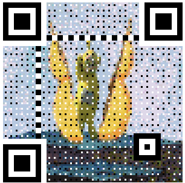
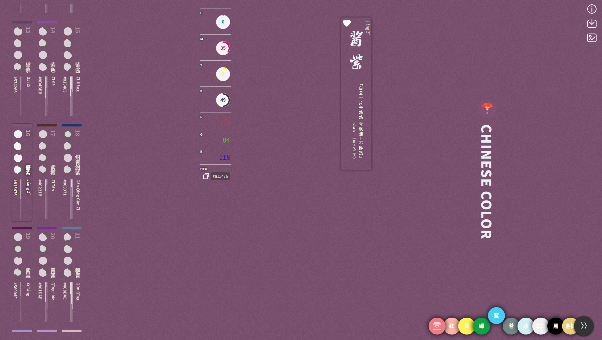

# 可视化库
## [chart.xkcd](https://github.com/timqian/chart.xkcd)

一款XKCD漫画风格的网页图标库

<!-- more -->

## [material-admin](https://github.com/enilu/material-admin)

基于 Spring Boot 的 Material Design 风格的通用后台管理系统。

# 前端

## ## [awsome-qrcode](https://github.com/ruanyf/weekly/issues/795)

在线生成各种不一样的二维码

# 工具

## [tmux](http://www.ruanyifeng.com/blog/2019/10/tmux.html)
一个将窗口和会话分离的命令行工具，允许在一个窗口创建多个会话并来回切换。同时支持窗口分割操作。

# 好玩的

## [morse-encryption](https://github.com/rover95/morse-encrypt)

原理是利用零宽字符对加密文本进行转码，嵌入到普通文本当中，从而隐藏加密内容；表面看起来是一段普通文本，复制粘贴不会丢失

## [raccoon](https://raccoon.onyxbits.de/)

将google play上的应用下载成apk

## [showmebug](https://www.showmebug.com/)

在线实时编程环境，用来面试程序员

## [中国传统颜色](https://colors.ichuantong.cn/)

